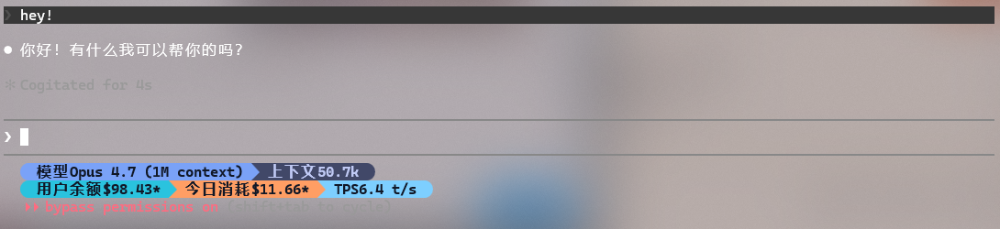

<div align="center">

# mochiapi-statusline

**[MochiAPI](https://mochiapi.com) 用户的 Claude Code 状态栏。**
一条命令装好。终端里看模型、上下文、账户余额、今日花费。

[](https://www.npmjs.com/package/mochiapi-statusline)
[](LICENSE)
[](https://nodejs.org)



</div>

---

## 安装

要 **Node.js ≥ 14**。一条命令装包 + 跑交互式 setup：

```bash
npm install -g mochiapi-statusline && mochiapi-statusline --mochiapi-setup
```

bash / zsh / fish / PowerShell 7+ / cmd.exe 都能跑，`&&` 把装包和 setup 串起来。

> **Windows PowerShell 5.1**（Win10 默认）不支持 `&&`，分两步：
> ```powershell
> npm install -g mochiapi-statusline
> mochiapi-statusline --mochiapi-setup
> ```

先去 <https://mochiapi.com/dashboard> 复制 token，setup 会让你粘贴。`--mochiapi-setup` 做四件事：

1. token + base URL → `~/.config/mochiapi-statusline/config.json`（Windows 是 `%APPDATA%\mochiapi-statusline\config.json`）
2. 探测一次 balance 接口，确认 token 有效
3. 把推荐的 **Mochi 两行 Powerline 布局**写入 `~/.config/mochiapi-statusline/settings.json`（已有布局会把 Mochi 计费行追加进去）
4. 把 Claude Code 的 `~/.claude/settings.json` 里 `statusLine.command` 指向 `mochiapi-statusline`

开一个新的 Claude Code 会话，状态栏就有了。

> **Windows + Powerline**：默认布局用 Nerd Font 字形做分隔符，没装会看到 `?` 方块。装一个并设为终端字体：
>
> ```powershell
> winget install DEVCOM.JetBrainsMonoNerdFont
> ```

`dist/mochiapi-statusline.js` 预构建产物直接打进 npm tarball，包不声明 `prepare` / `postinstall`，安装时不会跑本地构建，bundle 好的 binary 直接落地。

### 备用安装源

只在 npm registry 被墙、或者想跟 `main` HEAD 而不是 tag 发布时用：

```bash
# 跟踪 main HEAD（滚动，无版本锁定）
npm install -g github:Subaru486desuwa/mochiapi-statusline

# 锁到特定 git tag
npm install -g github:Subaru486desuwa/mochiapi-statusline#v0.1.1

# Tarball 直装（下载最小，等价于 github: 简写）
npm install -g https://github.com/Subaru486desuwa/mochiapi-statusline/archive/refs/heads/main.tar.gz
```

## 默认布局长这样

两行 Powerline，Mochi 配色（图中是实际效果）：

- **第一行** — `模型 / Opus 4.7 (1M context) / 上下文 / 50.7k`，仓库内追加 `<分支> / <改动>`，仓库外自动隐藏
- **第二行** — `用户余额 / $98.43 / 今日消耗 / $11.66 / TPS / 6.4 t/s`（MochiAPI 账户余额 + 今日花费 + token 输出速率）

数值后面带 `*` 表示缓存值比 `2 × refreshIntervalSec`（默认 60 秒）旧，通常是瞬时网络抖动，后台 refresher 在重试。widget 继续显示上一次成功值。

`mochiapi-subscription` widget（三合一：`余额 $X.XX · 今日 $Y.YY · 订阅 $Z.ZZ/∞`）仍然可用，只是不在默认布局——大多数 MochiAPI 中转用户订阅是 `∞`，没意义。需要的话 TUI 里手动加。

## MochiAPI 自带的 widget

三个 widget 共用一次 `/api/user/dashboard/balance` 请求的缓存：

| Widget 类型 | 渲染 | 默认色 |
|---|---|---|
| `mochiapi-balance` | 账户剩余余额 — `$X.XX` 或 `∞`（无限账户） | cyan |
| `mochiapi-daily-spend` | 今日花费 — `$X.XX` | magenta |
| `mochiapi-subscription` | `余额 $X.XX · 今日 $Y.YY · 订阅 $Z.ZZ/∞`（不在默认布局） | cyan |

缓存通过 detached 子进程每 `refreshIntervalSec`（默认 30 秒）刷新一次。

## CLI

```bash
# 再跑一次交互式 setup
mochiapi-statusline --mochiapi-setup

# 非交互（CI / 脚本）
MOCHIAPI_TOKEN=sk-xxxx MOCHIAPI_BASE_URL=https://mochiapi.com \
  mochiapi-statusline --mochiapi-setup

# 只写 mochi 配置，不动 mochiapi-statusline / Claude Code 设置
mochiapi-statusline --mochiapi-setup --skip-statusline --skip-claude-wire

# 手动刷一次余额缓存（后台每 30 秒也会自动刷）
mochiapi-statusline --mochiapi-refresh

# 启动 TUI 调整 widget / 颜色 / 布局 / Powerline
mochiapi-statusline
```

## 升级 / 卸载

```bash
# 升级到最新发布版本
npm install -g mochiapi-statusline@latest

# 卸载
npm uninstall -g mochiapi-statusline
```

## 文件位置

|  | macOS / Linux | Windows |
|---|---|---|
| MochiAPI token + baseUrl | `~/.config/mochiapi-statusline/config.json` | `%APPDATA%\mochiapi-statusline\config.json` |
| 余额缓存 | `~/.cache/mochiapi-statusline/balance.json` | `%LOCALAPPDATA%\mochiapi-statusline\cache\balance.json` |
| 状态栏布局 | `~/.config/mochiapi-statusline/settings.json` | `%USERPROFILE%\.config\mochiapi-statusline\settings.json` |
| Claude Code | `~/.claude/settings.json` | `%USERPROFILE%\.claude\settings.json` |

token 配置和布局配置是**两个不同的文件**：改鉴权动第一个，改显示哪些 widget 动第二个（或者跑 TUI）。

## 排错

| 状态栏显示 | 含义 | 处理 |
|---|---|---|
| `Mochi: cfg?` | 找不到 `config.json` | 重新跑 `mochiapi-statusline --mochiapi-setup` |
| `Mochi: ...` | 缓存还没填 | 跑 `mochiapi-statusline --mochiapi-refresh`，或等 30 秒 |
| `$X.XX*`（末尾 `*`） | 缓存陈旧 | 通常瞬时上游问题，后台 refresher 会自动重试 |
| 分隔符显示成 `?` | 终端没用 Nerd Font | 装 Nerd Font 并设为终端字体 |

不启动 Claude Code 也能渲染一次看看效果：

```bash
echo '{"session_id":"test","model":{"id":"claude-sonnet-4-6","display_name":"Sonnet 4.6 (1M context)"},"workspace":{"current_dir":".","project_dir":"."},"cost":{"total_cost_usd":0},"transcript_path":"/tmp/nonexistent","output_style":{"name":"default"}}' \
  | mochiapi-statusline
```

## 接口契约

| 路径 | 返回 |
|---|---|
| `GET ${baseUrl}/api/user/dashboard/balance` | 账户字段 + 今日花费（一次请求喂三个 widget） |

Bearer 鉴权（`Authorization: Bearer sk-...`），不用 cookie，不用 session。

从响应里读的字段：

| API 字段 | 用途 |
|---|---|
| 直接余额字段（`user_balance_usd` / `user_remain_quota_usd` / `balance_usd` 等，存在时） | 余额 widget（首选路径） |
| `data.user_quota_usd` − `data.user_used_quota_usd` | 余额 widget（直接字段缺失时的回退） |
| `data.today_used_quota_usd` | 今日花费 widget |
| `data.token_remain_quota_usd` + `data.token_unlimited` | 订阅 widget |

## 致谢

底层状态栏引擎 fork 自 [sirmalloc/ccstatusline](https://github.com/sirmalloc/ccstatusline)（MIT，© Matthew Breedlove）。MochiAPI 部分的增量只有：

- `mochiapi-balance` / `mochiapi-daily-spend` / `mochiapi-subscription` 三个 widget
- `--mochiapi-setup` / `--mochiapi-refresh` 两个 CLI flag
- 一键 setup（写 config + 写布局 + 接 Claude Code `statusLine.command`）

其余的 TUI、主题、布局、Powerline 渲染、20 多个其它 widget 全部是上游代码，深度自定义照样适用上游的 TUI。

## License

MIT — 见 [LICENSE](LICENSE) 和 [NOTICE](NOTICE)。
